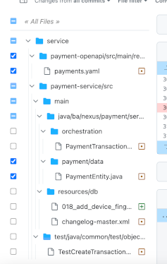

# Github Userscripts
Userscripts created to add functionality to Github

## Add View State to File Tree

[Install](https://github.com/tbickley-nex/github-userscripts/raw/main/github-add-view-state-to-file-tree.user.js)

This script adds checkboxes to each of the files in the file-tree on a PR to indicate whether it has been marked as
viewed or not.

It also adds checkboxes to each of the directories indicating whether all, some, or none of the files within that folder
have been viewed. These checkboxes can be used to toggle the viewed state of all files that exist within that folder.

